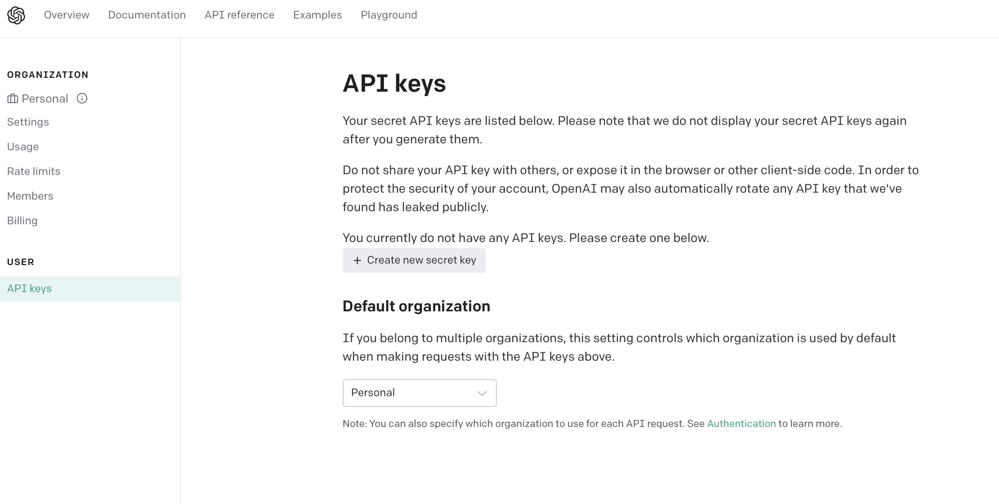
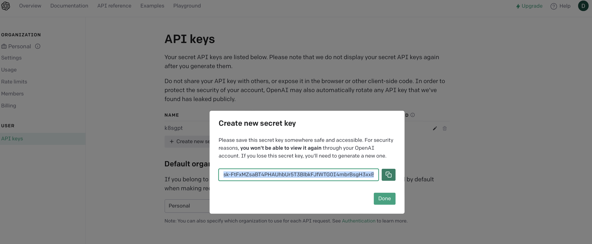

# AI applied to your cluster

## Install k8sgpt

On MacOS use brew to install **k8sgpt**

```console
$ brew tap k8sgpt-ai/k8sgpt
$ brew install k8sgpt
```

If using other OSes, just visit https://docs.k8sgpt.ai/getting-started/installation/


## Configure k8sgpt CLI for using OpenAI backend

Before using it, you need to configure a backend API key (default backend is openai).

To connect k8sgpt to the famous ChatGPT just type:

```console
$ k8sgpt generate
```

This will open a browser window where you will be asked to authenticate on OpenAI. Once done, you reach the page where to create a new API key.



Having done that, just copy the newly created API key on your clipboard.



Then type:

```console
$  k8sgpt auth 
```

and insert the API key you copied here after at the prompt.

By default, some filters (analyzers) are not enabled, you can add them (i.e.):

```console
$ k8sgpt filters add HorizontalPodAutoScaler
```

To analyse the cluster, just type:

```console
$ k8sgpt analyse --explain
```

## Use in-cluster operator with local AI models

Install the LocalAI server

```console
$ helm repo add go-skynet https://go-skynet.github.io/helm-charts/
$ helm repo update
$ helm install local-ai go-skynet/local-ai -f local-ai-values.yaml --version 1.0.3
```

After a while your pod should be running:

```console
$ kubectl get pods -l app.kubernetes.io/instance=local-ai
```

Assuming all is well, a local-ai Pod will be scheduled and you will see a pretty Fiber banner in the logs

```console
$ kubectl logs -l app.kubernetes.io/instance=local-ai
 ┌───────────────────────────────────────────────────┐ 
 │                   Fiber v2.45.0                   │ 
 │               http://127.0.0.1:8080               │ 
 │       (bound on host 0.0.0.0 and port 8080)       │ 
 │                                                   │ 
 │ Handlers ............ 16  Processes ........... 1 │ 
 │ Prefork ....... Disabled  PID .............. 3062 │ 
 └───────────────────────────────────────────────────┘
```

Now install the K8sGPT operator

```console
$ helm repo add k8sgpt https://charts.k8sgpt.ai/
$ helm repo update
$ helm install k8sgpt-operator k8sgpt/k8sgpt-operator --version 0.0.14
```

Check the k8sgpt pod using:

```console
$ kubectl get pod -l app.kubernetes.io/name=k8sgpt-operator
```

To finish it off, we have to create a K8sGPT custom resource

```console
$ kubectl apply -f - << EOF
apiVersion: core.k8sgpt.ai/v1alpha1
kind: K8sGPT
metadata:
  name: k8sgpt-local
  namespace: default
spec:
  backend: localai  
  # use the same model name here as the one you plugged
  # into the LocalAI helm chart's values.yaml
  model: ggml-gpt4all-j.bin
  # kubernetes-internal DNS name of the local-ai Service
  baseUrl: http://local-ai.default.svc.cluster.local:8080/v1
  # allow K8sGPT to store AI analyses in an in-memory cache,
  # otherwise your cluster may get throttled :)
  noCache: false
  version: v0.3.0
  enableAI: true
EOF
```

As soon as the K8sGPT CR hits your cluster, the K8sGPT operator will deploy K8sGPT and you should see some action in the LocalAI Pod’s logs.

```console
$ kubectl get pod -l app=k8sgpt-deployment # Shoudl be running
$ kubectl logs -l app.kubernetes.io/instance=local-ai # Something should happens in the pod's stdout
```

kubectl run fake-image --image=thisimage/doesnot:exists

More at https://github.com/k8sgpt-ai/k8sgpt-operator