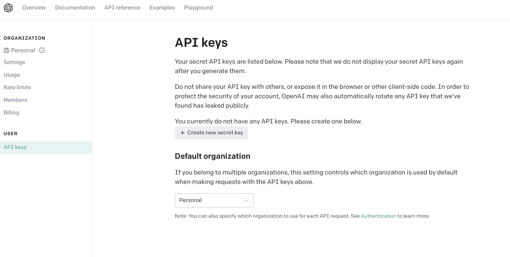
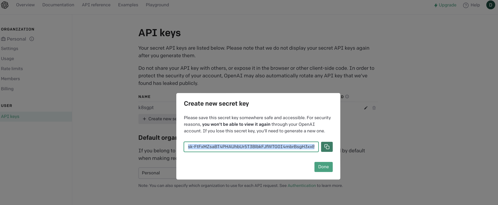

# AI applied to your cluster

## Install k8sgpt

On MacOS use brew to install **k8sgpt**

```console
$ brew tap k8sgpt-ai/k8sgpt
$ brew install k8sgpt
```

If using other OSes, just visit https://docs.k8sgpt.ai/getting-started/installation/


## Configure k8sgpt

Before using it, you need to configure a backend API key (default backend is openai).

To connect k8sgpt to the famous ChatGPT just type:

```console
$ k8sgpt generate
```

This will open a browser window where you will be asked to authenticate on OpenAI. Once done, you reach the page where to create a new API key.



Having done that, just copy the newly created API key on your clipboard.



Then type:

```console
$  k8sgpt auth 
```

and insert the API key you copied here after at the prompt.

To analyse the cluster, just type:

```console
$ k8sgpt analyse
```


